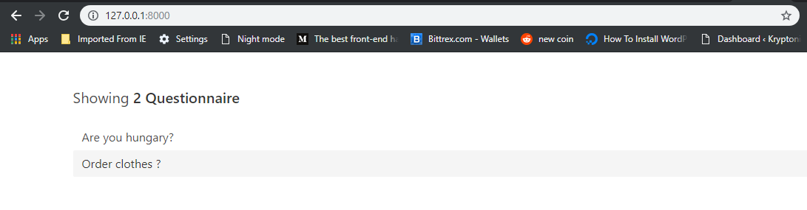
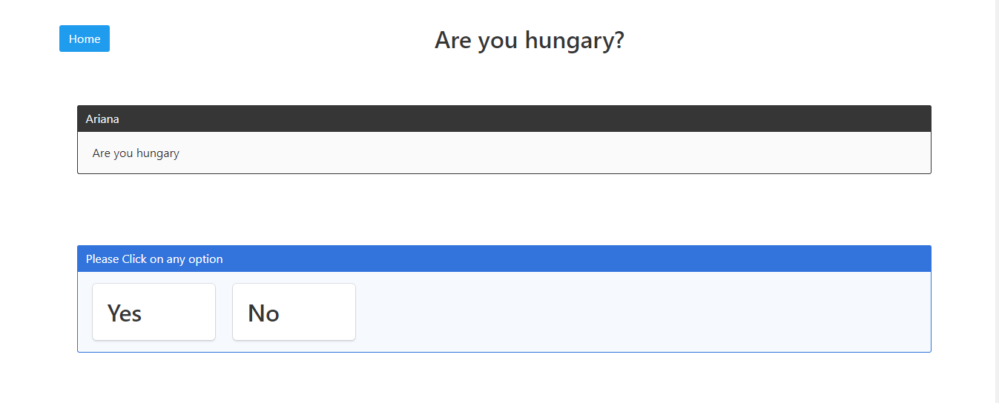
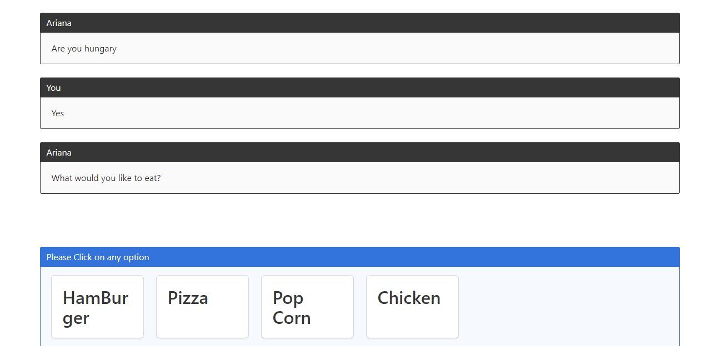
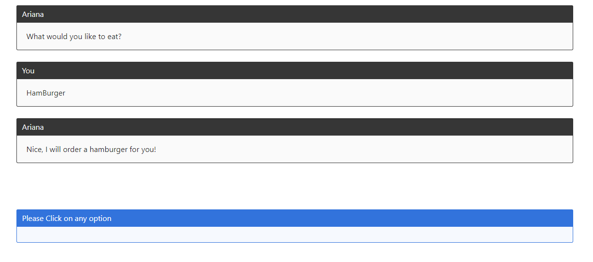

# Ariana
## It is chat style questionnarie app
 

***

### To Install dependencies 

Python dependencies : ` pipenv install ` 

Javascript dependencies : ` npm install `

***

### To Run App

` python manage.py runserver `

` npm run dev `

It should start the app on port 8000

### App flow

Click on any of the list item

***

***

***

